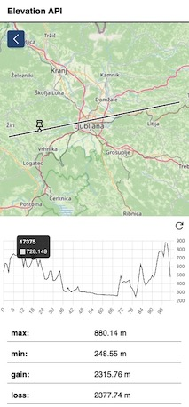

# ELEVATION API



### Features:
- TIF files as custom elevation sources files (e.g. [Copernicus EU DEM](https://land.copernicus.eu/imagery-in-situ/eu-dem/eu-dem-v1.1/view))
- Endpoints for GeoJSON geometry to retrieve elevations for each vertex
- Geometry interpolation with elevation profile
- Automatic coordinate system transformations using provided definitions ( ```data/spatial_reference.json```) for many SRID codes and geotiff metadata parsing

### Demo CLIENT
https://elevation-app.lipusblaz.com 

github: https://github.com/lipusmah/elevation-api-client

### Demo API (limited)
The swagger/open-api definitions can be found at:
https://elevation.lipusblaz.com/docs or https://elevation.lipusblaz.com/redoc

Try it directly:
https://elevation.lipusblaz.com/elevation/14.5128/46.1384?srid=4326

#### to-do:
- Tests
- CI testing pipeline
- Sub-pixel elevation interpolation (different functions - linear, cubic etc)


#### Quick start (docker)

```
    docker-compose up
```

then navigate to:

http://localhost:8080/docs or http://localhost:8080/docs


## Setup

There is 1 environmental variable:

ELEVATIONAPI_CONFIG_PATH="/data/config.json"

If working on other systems than ubuntu, update his variable accordingly

### Local setup
Prerequsites:
- GDAL installed and added to path
- Poetry

Create virtual environment and install packages:
```shell
poetry install
```

To get the path to the virtual environemt executable for debugging purposes:

```shell
poetry env info
```

For DEBUGGING run ```debug.py``` file with python interpreter set to **poetry env info** executable path.

Running for production (pyproject.toml script):
```shell
poetry run start
```

#### Testing
To run the tests inside /tests directory run:
```shell
poetry run pytest
```

### Docker

#### Using docker compose:

```sh
    docker-compose up
```

```/data/*``` directory si setup as mount in the docker image, providing a way to use and manage elevation geo tiff data.

#### Build and run docker image:

```sh
    docker image build .
```
```sh
    docker run hash-of-the-built-image
```


## Configuration 

```./data/config.json```

```json
{
    "datasources": [
        {
            "id": "test1",
            "name": "test1",
            "path": "./lj_eu_dem_v11.tif",
            //"srid": integer (read from geotiff file if not profided, otherwise it will be read from spatial_reference.json),
            //"extent": number[] (array of length 4 representing xmin, ymin, xmax, ymax in the coordinate system srid or )
        }
    ],
    "spatial_ref_sys_path": "./spatial_reference.json"
}
```

Provide all DEM tif files in "datasources" property of config.json.

The provided ```spatial_reference.json``` file defines many coordinate system for any region and is used sometimes if the **.*TIF** file doesnt contain encoded reference system definition.

